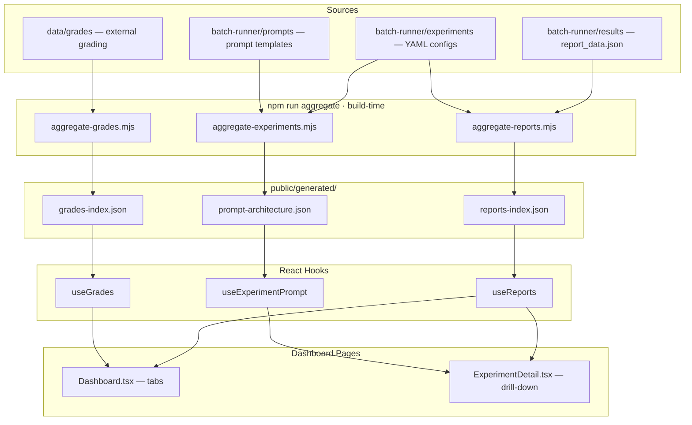

# 📊 GDPVal RealWorks Dashboard

> Interactive experiment analytics for the GDPVal benchmark.
> **[→ Live Dashboard](https://hyeonsangjeon.github.io/gdpval-realworks/)**

---

## What This Is

A React dashboard that visualizes LLM experiment results on **220 real-world expert tasks** across 11 sectors and 55 occupations. Compare prompt strategies, track sector-level performance, and drill into individual task outcomes — all without a backend server.

- **Static JSON** generated at build time → zero API calls at runtime
- **GitHub Pages** auto-deployed on every push to `main`
- **HuggingFace** lazy-loads per-task data on the Experiment Detail page

---

## Data Flow



> Task-level data (220 rows per experiment) is **not** bundled — it is fetched from HuggingFace on demand when you open an experiment detail page.

---

## Features

### Leaderboard + Sector Heatmap

<p align="center">
  
</p>

### Experiment Detail

<p align="center">
  
</p>

<p align="center">
  
</p>

### Prompt Architecture Viewer

<p align="center">
  
</p>

| Feature | Tab / Page | What you see |
|---------|-----------|-------------|
| **KPI Cards** | main | Best Success Rate, Experiment count, Tasks count, Best QA Score |
| **Leaderboard** | Leaderboard | Ranked experiments — strategy, model, progress, success rate, Δ best, QA |
| **Sector Heatmap** | Leaderboard | 9 sectors × N experiments, color-coded success rate matrix |
| **Trend Charts** | Trends | Success Rate / QA Score / Latency trends across experiments |
| **Execution Errors** | Execution Errors | Error distribution, CONFIDENCE NameError banner, recovery funnel |
| **Grading Analysis** | Grading Analysis | External evaluation scores (OpenAI Evals integration) |
| **Experiment Detail** | /experiment/:id | 220-task table, sector/status filters, QA distribution, resume rounds |
| **Prompt Architecture** | /experiment/:id | System → User Prompt → QA → Config accordion viewer |
| **Dark / Light Theme** | global | Toggle in header |

---

## Tech Stack

```
React 18 · TypeScript · Vite · Tailwind CSS · Recharts · Framer Motion
```

- **Build-time** aggregate scripts turn YAML + JSON into static data
- **Runtime** is pure client-side React — no Node server, no database
- **Deployment** via GitHub Actions → GitHub Pages

---

## Project Structure

```
src/
├── pages/
│   ├── Dashboard.tsx              # Main dashboard (tab routing)
│   ├── ExperimentDetail.tsx       # Per-experiment deep-dive
│   └── GradeDetail.tsx            # External grading detail
├── components/
│   ├── dashboard/
│   │   ├── LeaderboardView.tsx    # Leaderboard + sector heatmap
│   │   ├── TrendView.tsx          # Trend charts
│   │   ├── ErrorAnalysisView.tsx  # Error analysis
│   │   ├── GradingAnalysisView.tsx# Grading results
│   │   └── PromptArchitectureView.tsx # Prompt structure viewer
│   ├── ExperimentCard.tsx         # Experiment summary card
│   ├── ScopeBadge.tsx             # Self-assessed / graded badge
│   ├── Header.tsx                 # Global header
│   └── ui/                        # shadcn/ui primitives
├── hooks/
│   ├── useReports.ts              # Fetch reports-index.json
│   ├── useGrades.ts               # Fetch grades-index.json
│   ├── useExperimentPrompt.ts     # Fetch prompt-architecture.json
│   ├── useExperiments.ts          # Fetch experiments-index.json
│   └── useIsMobile.ts             # Responsive breakpoint
├── types/
│   └── report.ts                  # TypeScript interfaces
├── contexts/
│   └── ThemeContext.tsx            # Dark / Light theme state
├── data/
│   └── tooltipTexts.ts            # UI tooltip strings
└── utils/
```

---

## Local Development

```bash
# Install dependencies
npm install

# Generate build-time data (required before first run)
npm run aggregate

# Dev server with hot reload
npm run dev
# → http://localhost:5173/gdpval-realworks/

# Production build
npm run build
npm run preview
```

> `npm run dev` automatically runs all aggregate scripts via the `predev` hook.

---

## How New Experiments Appear

The entire flow from experiment to dashboard is automated:

```
1. GitHub Actions runs batch experiment (triggered manually from Actions tab)
2. Pipeline completes → results uploaded to HuggingFace → PR auto-created
3. You review and merge the PR
4. deploy.yml auto-triggers on main push → aggregate scripts regenerate JSON → GitHub Pages redeploys
5. Dashboard shows new experiment on next page load
```

> No manual deploy button needed. Merging the PR is the only human step after triggering the experiment.

---

## Design System

For contributors working on dashboard UI:

| Element | Value |
|---------|-------|
| Page background | `bg-[#0a0a1a]` (dark) · `bg-gray-50` (light) |
| Card border | `rgba(255,255,255,0.06)` |
| Numbers / metrics | `font-mono` |
| Success rate colors | ≥96% `emerald` · ≥90% `amber` · <90% `red` |
| Charts | Recharts with dark tooltip `bg: #1a1a2e` |
| Animations | Framer Motion — fade-in + slide-up |
| Theme toggle | `ThemeContext.tsx` · class-based dark mode |
