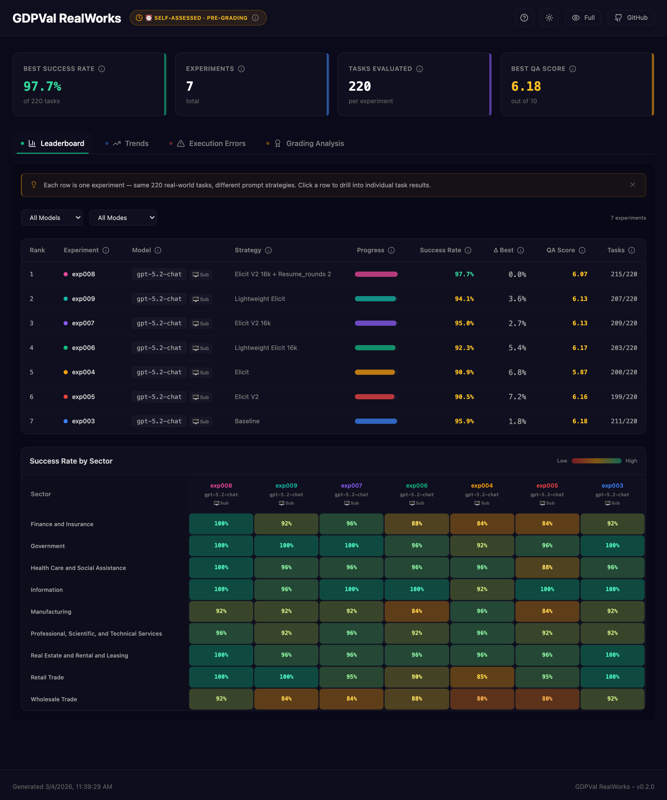
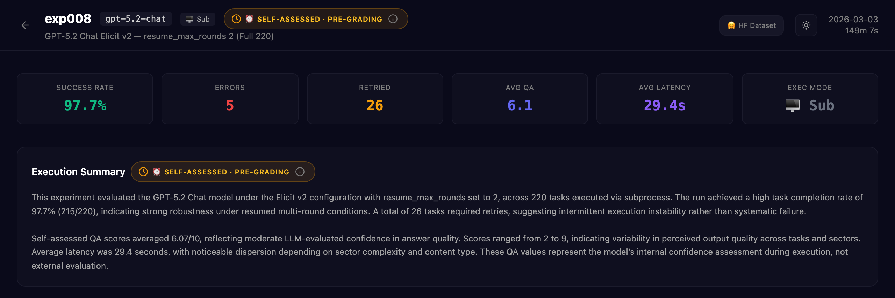
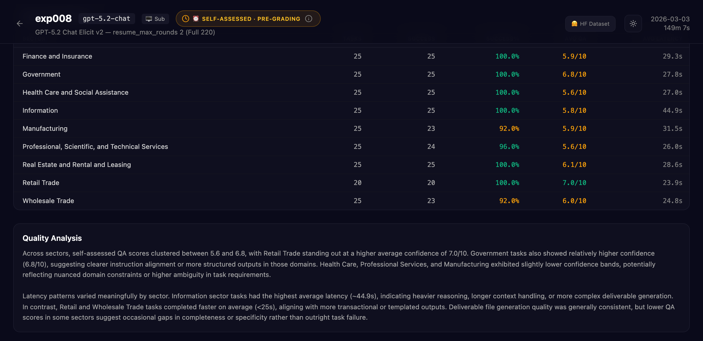
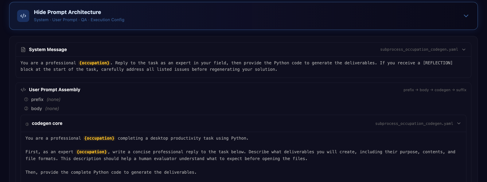

# 📊 GDPVal RealWorks 대시보드

> GDPVal 벤치마크를 위한 인터랙티브 실험 분석 대시보드.
> **[→ 라이브 대시보드](https://hyeonsangjeon.github.io/gdpval-realworks/)**

🇺🇸 [English](README.md) · 🇯🇵 [日本語](README_JP.md)

---

## 개요

**220개 실무 전문가 태스크** (11개 산업, 55개 직종)에 대한 LLM 실험 결과를 시각화하는 React 대시보드입니다. 프롬프트 전략 비교, 섹터별 성능 추적, 개별 태스크 결과 드릴다운까지 — 백엔드 서버 없이 모두 가능합니다.

- **정적 JSON** 빌드 시 생성 → 런타임 API 호출 없음
- **GitHub Pages** 자동 배포 (`main` 푸시 시)
- **HuggingFace** 태스크별 데이터 지연 로딩 (실험 상세 페이지)

---

## 데이터 흐름

<p align="center">
  
</p>

> 태스크별 상세 데이터(실험당 220행)는 번들에 **포함되지 않습니다** — 실험 상세 페이지를 열 때 HuggingFace에서 온디맨드로 가져옵니다.

---

## 기능 목록

### 리더보드 + 섹터 히트맵

<p align="center">
  
</p>

### 실험 상세

<p align="center">
  
</p>

<p align="center">
  
</p>

### 프롬프트 아키텍처 뷰어

<p align="center">
  
</p>

| 기능 | 탭 / 페이지 | 설명 |
|------|-----------|------|
| **KPI 카드** | 메인 | 최고 성공률, 실험 수, 태스크 수, 최고 QA 점수 |
| **리더보드** | Leaderboard | 실험 랭킹 — 전략, 모델, 진행률, 성공률, Δ best, QA 점수 |
| **섹터 히트맵** | Leaderboard | 9개 섹터 × N개 실험 성공률 매트릭스 (색상 코딩) |
| **트렌드 차트** | Trends | 실험 간 성공률 / QA 점수 / 지연시간 추이 |
| **실행 에러** | Execution Errors | 에러 분포, CONFIDENCE NameError 배너, 복구 퍼널 |
| **채점 분석** | Grading Analysis | 외부 평가 점수 (OpenAI Evals 연동) |
| **실험 상세** | /experiment/:id | 220-태스크 테이블, 섹터/상태 필터, QA 분포, 재시도 라운드 |
| **프롬프트 아키텍처** | /experiment/:id | System → User Prompt → QA → Config 아코디언 뷰어 |
| **다크/라이트 테마** | 전역 | 헤더에서 토글 |

---

## 기술 스택

```
React 18 · TypeScript · Vite · Tailwind CSS · Recharts · Framer Motion
```

- **빌드 시점**: aggregate 스크립트가 YAML + JSON을 정적 데이터로 변환
- **런타임**: 순수 클라이언트 React — Node 서버 없음, 데이터베이스 없음
- **배포**: GitHub Actions → GitHub Pages

---

## 프로젝트 구조

```
src/
├── pages/
│   ├── Dashboard.tsx              # 메인 대시보드 (탭 라우팅)
│   ├── ExperimentDetail.tsx       # 실험 상세 페이지
│   └── GradeDetail.tsx            # 외부 채점 상세
├── components/
│   ├── dashboard/
│   │   ├── LeaderboardView.tsx    # 리더보드 + 섹터 히트맵
│   │   ├── TrendView.tsx          # 트렌드 차트
│   │   ├── ErrorAnalysisView.tsx  # 에러 분석
│   │   ├── GradingAnalysisView.tsx# 채점 결과
│   │   └── PromptArchitectureView.tsx # 프롬프트 구조 뷰어
│   ├── ExperimentCard.tsx         # 실험 요약 카드
│   ├── ScopeBadge.tsx             # 자가평가 / 채점됨 배지
│   ├── Header.tsx                 # 글로벌 헤더
│   └── ui/                        # shadcn/ui 기본 컴포넌트
├── hooks/
│   ├── useReports.ts              # reports-index.json 패치
│   ├── useGrades.ts               # grades-index.json 패치
│   ├── useExperimentPrompt.ts     # prompt-architecture.json 패치
│   ├── useExperiments.ts          # experiments-index.json 패치
│   └── useIsMobile.ts             # 반응형 브레이크포인트
├── types/
│   └── report.ts                  # TypeScript 인터페이스
├── contexts/
│   └── ThemeContext.tsx            # 다크/라이트 테마 상태
├── data/
│   └── tooltipTexts.ts            # UI 툴팁 텍스트
└── utils/
```

---

## 로컬 개발

```bash
# 의존성 설치
npm install

# 빌드 시점 데이터 생성 (첫 실행 전 필수)
npm run aggregate

# 핫 리로드 개발 서버
npm run dev
# → http://localhost:5173/gdpval-realworks/

# 프로덕션 빌드
npm run build
npm run preview
```

> `npm run dev` 실행 시 `predev` 훅이 모든 aggregate 스크립트를 자동 실행합니다.

---

## 새 실험이 반영되는 과정

실험에서 대시보드까지 전체 흐름이 자동화되어 있습니다:

```
1. GitHub Actions에서 배치 실험 실행 (Actions 탭에서 수동 트리거)
2. 파이프라인 완료 → 결과가 HuggingFace에 업로드 → PR 자동 생성
3. PR을 리뷰하고 머지
4. deploy.yml이 main 푸시 시 자동 트리거 → aggregate 스크립트가 JSON 재생성 → GitHub Pages 재배포
5. 다음 페이지 로드 시 대시보드에 새 실험 반영
```

> 수동 배포 버튼 불필요. 실험 트리거 후 유일한 수동 작업은 PR 머지뿐입니다.

---

## 디자인 시스템

대시보드 UI 작업을 위한 참고 가이드:

| 요소 | 값 |
|------|-----|
| 페이지 배경 | `bg-[#0a0a1a]` (다크) · `bg-gray-50` (라이트) |
| 카드 테두리 | `rgba(255,255,255,0.06)` |
| 숫자/메트릭 | `font-mono` |
| 성공률 색상 | ≥96% `emerald` · ≥90% `amber` · <90% `red` |
| 차트 | Recharts, 다크 툴팁 `bg: #1a1a2e` |
| 애니메이션 | Framer Motion — 페이드인 + 슬라이드업 |
| 테마 토글 | `ThemeContext.tsx` · 클래스 기반 다크 모드 |
